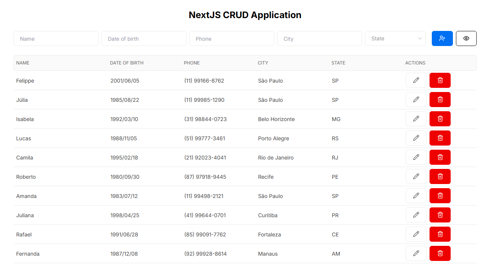

<h1>
    Next.js CRUD Application
</h1>



## 🧾 Sobre

Aplicativo fictício para gestão de pessoas. O usuário pode visualizar, criar, atualizar e/ou excluir usuários, além de poder filtrar por nome, data de nascimento, telefone, cidade e estado, caso necessário.

## 💻 Tecnologias utilizadas

- Next.js
- Tailwind CSS
- TypeScript
- Axios
- TanStack Query
- json-server
- React Hook Form
- Zod
- date-fns

## 🛠️ Como utilizar

Instale as dependências do projeto:

```bash
npm install
```

Inicie a API:

```bash
npm run server
```

Inicie o projeto:

```bash
npm run dev
```

Por fim, abra [http://localhost:3000](http://localhost:3000) no seu navegador.
